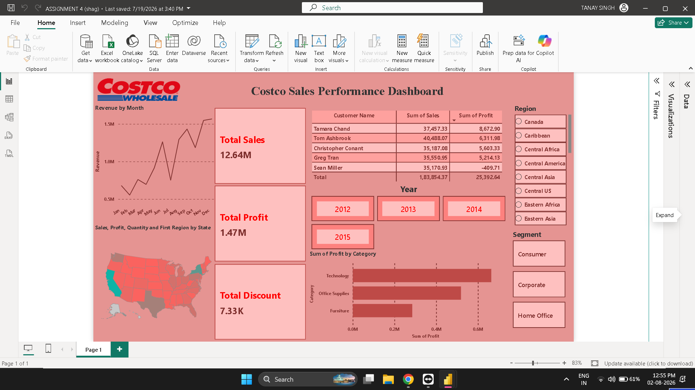

# 📊 Costco Sales Performance Dashboard

## 📌 Project Overview

This project presents an interactive **Costco Sales Performance Dashboard** built in **Microsoft Power BI** to analyze sales performance, profitability, customer trends, and regional insights.

The dashboard enables users to explore business performance through dynamic visualizations, KPI cards, maps, and interactive slicers, making it easier to identify sales trends and support data-driven decision-making.

---

## 🎯 Objectives

- Analyze overall sales performance
- Track profit and discount metrics
- Identify top-performing customers
- Compare profit across product categories
- Visualize geographical sales distribution
- Enable interactive filtering by Year, Region, and Segment

---

## 📂 Dataset

The dashboard is built using a Costco sales dataset containing:

- Sales
- Profit
- Discount
- Customer Details
- Product Categories
- Regions
- States
- Order Dates


## 🛠️ Tools & Technologies

- Microsoft Power BI Desktop
- Power Query
- DAX
- Data Modeling

---

## 📈 Dashboard Features

### 📌 KPI Cards

- Total Sales
- Total Profit
- Total Discount

### 📊 Charts & Visualizations

- Monthly Revenue Trend (Line Chart)
- Profit by Category (Bar Chart)
- Sales Distribution by State (Map)
- Top Customers Table

### 🎛️ Interactive Filters

- Year
- Region
- Segment

---

## 📷 Dashboard Preview



---

## 📊 Key Insights

- Technology generated the highest overall profit.
- Sales performance can be analyzed month-wise using the revenue trend.
- Regional filters help compare business performance across different locations.
- Customer-wise sales and profit enable identification of high-value customers.
- Interactive slicers allow detailed exploration by Year, Region, and Customer Segment.

---

## 📁 Repository Structure

```text
Costco-Sales-Performance-Dashboard/
│
├── Costco_Sales_Dashboard.pbix
├── README.md
│
├── Costco_Sales.csv
│ 
└── dashboard.png
```

---

## 🚀 Getting Started

1. Clone this repository.
2. Open **Costco_Sales_Dashboard.pbix** using Microsoft Power BI Desktop.
3. Refresh the dataset if required.
4. Explore the interactive dashboard.

---

## 📚 Skills Demonstrated

- Power BI Dashboard Development
- Data Visualization
- KPI Design
- Data Modeling
- DAX Measures
- Power Query
- Interactive Reporting
- Business Intelligence

---

## 👨‍💻 Author

**Shagun Gupta**

Aspiring Data Analyst | Power BI | SQL | Python | Excel | Tableau
